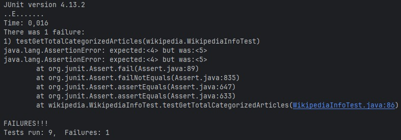
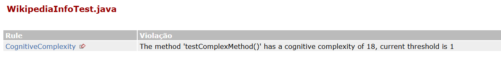
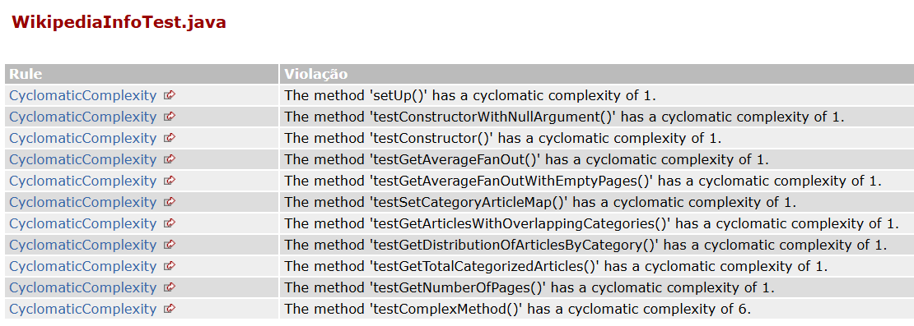
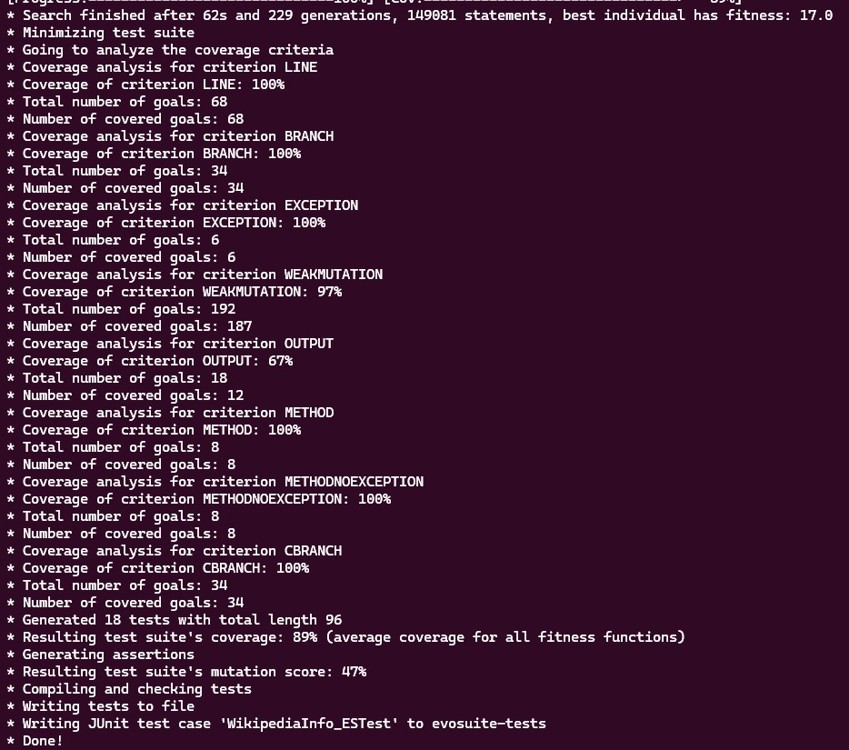
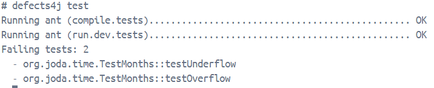

## Integrantes:
- EDGAR DE SOUZA DIAS 
- ISAAC LEVI LIRA DE OLIVEIRA 
- JOSÉ MATHEUS RIBEIRO DOS SANTOS 
- LEONARDO ALEXANDRE DE SOUZA BARRETO
- ULISSES DE JESUS CAVALCANTE 

## 1. Identificação do Artigo

**Nome:** *ChatGPT vs SBST: A Comparative Assessment of Unit Test Suite Generation*

**Seção:** *Unit test case generation*

## 2. Descrição do problema

A verificação individual de componentes de software, conhecida como teste de unidade, é uma prática comum na avaliação da qualidade de um programa. A meta central é assegurar que cada parte do software funcione corretamente, de acordo com o projeto.

As Técnicas de Teste de Software Baseadas em Busca (SBST) têm sido muito usadas para criar cenários de teste de unidade. As SBST utilizam algoritmos de busca, como algoritmos genéticos, para aperfeiçoar os conjuntos de teste. O intuito delas é otimizar esses conjuntos de teste para ampliar a cobertura do código e descobrir falhas no programa. Contudo, as SBSTs podem ser difíceis de aprender para testadores menos experientes.

Ultimamente, os Modelos de Linguagem Grandes (LLMs), como o ChatGPT, têm se destacado em diversas atividades e mostrado aptidão em várias áreas da engenharia de software. A razão para o estudo é que softwares baseados em LLMs podem cumprir a mesma tarefa (criar conjuntos de teste) com baixo custo de aprendizado, diferente das SBST.

Mesmo com o potencial das LLMs, ainda é incerto se os testes de unidade criados por elas se comparam aos produzidos por modelos e técnicas avançadas de inteligência artificial, sobretudo quanto à clareza, facilidade de compreensão, confiabilidade e aplicação prática.

## 3. Discussão da solução proposta
  
Este estudo explora o emprego do ChatGPT, um modelo de linguagem extenso, na elaboração de conjuntos de testes unitários. Essencialmente, o ChatGPT é uma aplicação do GPT-3, alicerçado em decodificadores Transformer de várias camadas. A estrutura Transformer é crucial para a capacidade dos LLMs de entender e processar textos em linguagem natural, além de gerar textos consistentes com base nas informações recebidas.

O ChatGPT opera como um agente conversacional, no qual o usuário (seja um desenvolvedor ou testador) submete um comando (uma instrução ou questão) em linguagem comum, e o ChatGPT oferece uma resposta com base no conhecimento obtido durante o seu aprendizado.

Apesar de promissor, o ChatGPT, sendo um LLM com base em Transformer, desenvolvido para antecipar a sequência seguinte de palavras, apresenta algumas limitações na criação de testes. Tais limitações incluem a ausência de uma perspectiva global do projeto, falta de sistemas de _feedback_ iterativo, validações pouco seguras e restrições no tamanho da entrada.

Em síntese, a proposta utiliza a aptidão do ChatGPT para entender o significado e gerar texto (fruto de sua arquitetura Transformer e treinamento aprofundado) para facilitar a criação inicial de testes unitários, com baixo investimento em aprendizado e fácil compreensão. No entanto, enfrenta obstáculos devido à carência de contexto do projeto e à inexistência de sistemas de _feedback_ iterativo, que são cruciais para a criação de testes confiáveis e com alta abrangência, além de ainda depender da ação humana para correção e validação.

## 4. Identificação do modelo

O modelo utilizado no trabalho selecionado é o *GPT-3*. Atualmente, o modelo não está mais acessível. Com relação ao tipo de arquitetura, o *GPT-3* foi construído sobre decodificadores *Transformer* multicamada, ou seja, é do tipo *decoder-only*.

Já nos exemplos, usamos o modelo DeepSeek-V3-Base. Ela está disponível no *HuggingFace* através desse [*link*](https://huggingface.co/deepseek-ai/DeepSeek-V3-Base). Assim como o *GTP-3*, esse modelo é do tipo *decoder-only*.

## 5. Identificação do dataset

**Nome:** benchmark existente no *DynaMOSA* (*Dynamic Many-Objective Sorting Algorithm*)

**Versão:** Não especificada no artigo

**URL:** https://drive.google.com/file/d/1blxEGa_9DGN8yU8MMOcLQu_haicpVKRS/view

## 6. Avaliação da solução e exemplo

A solução, que envolve a geração de conjuntos de teste de unidade pelo ChatGPT e sua comparação com a ferramenta SBST EvoSuite, foi avaliada sistematicamente com base em quatro fatores críticos: corretude, legibilidade, cobertura de código e capacidade de detecção de bugs.

### 6.1. Avaliação de corretude

A corretude foi avaliada sob três aspectos:

- **Sucesso no retorno:** Verificou-se se o ChatGPT retornou com sucesso os casos de teste para cada entrada.
- **Compilação e Execução:** Avaliou-se se os casos de teste gerados podiam ser compilados e executados sem erros, utilizando a Java Virtual Machine (JVM).
- **Bugs Potenciais:** Utilizou-se o analisador estático *SpotBugs* para escanear os casos de teste gerados pelo ChatGPT e identificar a presença de potenciais bugs ou vulnerabilidades.

Para 207 classes Java, o ChatGPT conseguiu gerar casos de teste de unidade com sucesso para todas as classes. No entanto, apenas 144 (69,6%) desses casos de teste puderam ser compilados e executados sem a necessidade de intervenção humana.

### 6.2. Avaliação de legibilidade

A avaliação da clareza do código foi desmembrada em duas partes distintas:

- **Conformidade com o Estilo:** Foi empregado o *Checkstyle* para garantir a aderência às normas de codificação *Sun Code Conventions* e *Google Java Style*.
- **Facilidade de Entendimento:** Aferida por meio das métricas de complexidade ciclomática e complexidade cognitiva, com o auxílio do plugin *PMD IntelliJ*.

Em média, foram encontradas cerca de 70 infrações ao *Google Java Style* e 28 ao *Sun Code Conventions*. Problemas de indentação foram os mais frequentes, indicando que o ChatGPT deve aprimorar a consistência da formatação do código para otimizar a legibilidade.

Todos os 3302 métodos analisados demonstraram baixa complexidade cognitiva, indicando fácil compreensão. Praticamente todos os métodos (3300 de 3302) apresentaram baixa complexidade ciclomática (1-4), e os 2 métodos restantes exibiram complexidade moderada (5-7).

Apesar das falhas no estilo do código, os testes automatizados criados pelo ChatGPT são, em sua maioria, simples de entender e de baixa complexidade.

### 6.3. Avaliação da cobertura do código em relação ao SBST

A **cobertura de instrução (Statement Coverage - SC)** foi medida utilizando a ferramenta **JaCoCo**. Os casos de teste não corrigíveis tiveram cobertura de 0%. O EvoSuite foi executado 30 vezes para cada classe para reduzir o viés da aleatoriedade, e os resultados foram comparados com os do ChatGPT.

Em média, o EvoSuite atingiu uma SC média de 74,2% para todos os projetos. Em contraste, o ChatGPT atingiu uma SC média de 55,4% para todos os projetos. O EvoSuite superou o ChatGPT em 19,1% em termos de SC geral.

A medida geral de *Vargha-Delaney* indicou que o EvoSuite é esmagadoramente melhor que o ChatGPT em alcançar maior cobertura de código, tanto para classes grandes quanto para pequenas. A causa disse pode ser porque o ChatGPT recebe apenas a classe sob teste, não o projeto inteiro, o que dificulta a geração de casos de teste mais valiosos.

### 6.4. Avaliação da capacidade de detecção de bugs em relação ao SBST

Geraram-se conjuntos de teste de unidade para as classes alvo na **base de dados de defeitos Defects4J** e verificou-se se esses conjuntos de teste conseguiam capturar os bugs. Para justa comparação, o EvoSuite foi executado apenas uma vez. Devido à imprecisão das asserções geradas pelo ChatGPT (que podem ser incorretas para bugs lógicos), o estudo **focou em bugs associados a exceções Java** (como `NullPointerException`, `UnsupportedOperationException`).

O EvoSuite geralmente detectou mais bugs e alcançou maior cobertura de código. No entanto, em alguns casos, o ChatGPT detectou mais bugs do que o EvoSuite. Isso sugere que as ferramentas podem se complementar.

### 6.5. Exemplo de avaliação da solução

Para o nosso exemplo, replicaremos a sequência de avaliações feitas no artigo utilizando a mesma versão do SBST *Evosuite* para gerar os arquivos de teste, enquanto a LLM escolhida foi o *DeepSeek*, que também irá gerar nossos arquivos de teste. Em favor da complexidade da tarefa, realizamos o processo com apenas uma classe Java, a [`WikipediaInfo.java`](src/DynaMOSA/WikipediaInfo.java), uma das classes testadas no artigo original e das classes [`Days.java`](src/Defects4j/Days.java) e [`Months.java`](src/Defects4j/Months.java).

#### RQ1.
A execução dos testes gerados pelo DeepSeek para a classe WikipediaInfo.java apresentou 9 casos de teste, dos quais 8 foram aprovados e 1 apresentou falha. A falha ocorreu no teste testGetTotalCategorizedArticles, pois o valor esperado era 4, mas retornou 5. Isso indica que os testes gerados pela LLM funcionaram corretamente.

Esses resultados demonstram que o DeepSeek é capaz de criar testes executáveis que verificam corretamente o comportamentos da classe, inclusive o valor esperado da função.

#### RQ2.
Assim como foi feito no artigo, a verificação de legibilidade foi realizada com o uso da ferramenta Checkstyle, o que permitiu a avaliação da aderência dos testes gerados pelo *DeepSeek* às convenções de código Java da *Sun* e ao guia de estilo Java do Google.

Como resultado, considerando a padronização de estilo Java do Google, foram identificadas 61 inconsistências no total. Dentre as violações, os problemas estavam relacionados à indentação, à ordem e à formatação das importações, além do uso de importações genéricas.

Já na verificação feita utilizando as convenções de código Java da *Sun Code Conventions*, foram encontrados 47 problemas no código. Dentre eles, podemos citar problemas envolvendo “números mágicos”, importações genéricas, linhas com mais de 80 caracteres, ausência de comentários Javadoc, linhas com espaços em branco à direita e ausência de linha em branco ao final do arquivo.

Para a análise de complexidade, quase todos os métodos mostraram ter baixa complexidade cognitiva, exceto um que mostrou um nível alto (18). 

Ademais, na avaliação de complexidade ciclomática, 10 dos 11 demonstraram ter um nível baixo, enquanto 1 método mostrou uma complexidade moderada.

Portanto, assim como os testes gerados pelo *ChatGPT*, a maioria dos testes gerados pelo DeepSeek também são simples de entender.

#### RQ3.
A partir da análise de cobertura de código realizada pelo `JaCoCo`, avaliando os casos de teste gerados pelo *Deepseek*, obtivemos os seguintes resultados:

**Cobertura de Instruções (56%):** das 464 instruções totais, apenas 204 foram executadas pelos testes;

**Cobertura de Ramificações (92%)**: das 28 ramificações avaliadas, apenas 2 não foram cobertas;

**Cobertura de Linhas (66%)**: das 68 linhas de código, 23 não foram cobertas;

**Complexidade Ciclomática (91%)**: dos 22 pontos de decisão (complexidade), 2 não foram executados;

**Cobertura de Métodos (87%)**: dos 8 métodos existentes, 1 não foi testado.

Já na análise de cobertura realizada pelo *Evosuite*, que calcula as métricas do arquivo que foi gerado. O resultado alcançou cobertura de linhas, *branches*, métodos e exceções perfeitas, ou seja, 100% das linhas, pontos de decisão, métodos e exceptions foram cobertos. A métrica mais fraca foi a cobertura de *output*, com apenas 12 dos 18 objetivos alcançados, o que sugere que faltam algumas validações de saída. O *Evosuite* também aplica mutação, neste código a *Mutation Score* de 47% indica que os testes conseguem matar apenas 47% dos mutantes, ou seja, há espaço para melhorar ainda mais os testes.

Essa análise sugere que o conjunto de teste tem uma cobertura estrutural sólida, mas não tem uma cobertura muito boa sobre validações do comportamento esperado do código e asserções mais específicas como valores de retorno e estados alterados. Por isso o artigo de Tang sugere que as LLMs e o *Evosuite* podem ser complementares.

#### RQ4.

A partir das classes [`Days.java`](src/Defects4j/Days.java) e [`Months.java`](src/Defects4j/Months.java), encontradas no *dataset* do *Defects4j*, foram gerados casos de testes pelo *DeepSeek*. Dessa forma, usando o *benckmark* do *Defects4j* para esses casos de testes foram encontrados 2 bugs em uma das classes geradas. O problema foi causado pelo desconhecimento do *DeepSeek* do projeto inteiro quando criou o caso de teste.

## 7. Potencial de uso da solução

O ChatGPT destaca-se por ter uma curva de aprendizado quase nula ao criar conjuntos de testes, o que o torna incrivelmente fácil de usar para testadores iniciantes ou desenvolvedores com pouca vivência em técnicas de Teste de Software Baseado em Busca (SBST).

Além disso, o ChatGPT possui uma capacidade poderosa de entender o significado e o contexto do código em avaliação. Isso permite gerar dados de teste mais adequados ao contexto semântico (por exemplo, usar "Brasil" como argumento para o método `setCountry`, em vez de uma sequência aleatória de caracteres).

Os cenários de teste criados pelo ChatGPT são simples e fáceis de entender. Essa característica é essencial para que os desenvolvedores consigam manter, compreender e modificar o código de teste facilmente com o passar do tempo.

Mesmo não ultrapassando o EvoSuite em termos de abrangência, o ChatGPT ainda consegue alcançar uma cobertura de código significativa. Isso o torna uma ferramenta inicial interessante para quem está começando em testes.

Em algumas situações, o ChatGPT conseguiu descobrir erros que o EvoSuite não encontrou. Isso sugere que as duas ferramentas podem se complementar e, quando usadas juntas, podem ampliar a capacidade de encontrar bugs em um projeto.

## 8. Limitações da solução

- **Necessidade de consulta manual e falta de visibilidade interna do modelo:** O estudo foi limitado às consultas realizadas manualmente ao ChatGPT. Como o ChatGPT é de código fechado, não é possível mapear os resultados para detalhes ou características internas do seu modelo. Além disso, não se conhece os dados de treinamento exatos do ChatGPT, o que impede determinar se as respostas às consultas são membros dos dados de treinamento.

- **Variação devido a atualizações contínuas do ChatGPT:** O ChatGPT está em constante atualização e treinamento. Isso significa que as respostas observadas no estudo refletem apenas o desempenho da versão do ChatGPT utilizada no momento do trabalho (versão de 30 de janeiro de 2023), e podem não ser representativas de versões futuras ou passadas.

- **Dificuldade em lidar com entradas longas:** O ChatGPT possui um limite máximo de comprimento de entrada de 2.048 tokens, aproximadamente 340-350 palavras. Se a entrada for muito longa, o ChatGPT reporta um erro e não responde. A tentativa de dividir a classe inteira por métodos para gerar casos de teste pode prejudicar a qualidade dos casos de teste gerados, pois o ChatGPT perde informações sobre a classe como um todo. Por essa razão, classes com mais de 4.096 tokens foram descartadas no estudo.

## 9. Sugestão de melhoria na solução

Considerando as limitações da solução, como a necessidade de consulta manual e a falta de visibilidade interna do modelo, e a ausência de mecanismos de feedback semelhantes aos do SBST, uma sugestão para aprimorar a solução seria a implementação de um ciclo iterativo de feedback e auto-correção automatizado para o ChatGPT. Isso consistiria em:

- O ChatGPT gera uma suíte de testes de unidade para uma determinada classe, conforme a prática atual.

- Um sistema externo recebe esses testes gerados e os submete a uma série de verificações automatizadas.

- Com base nos resultados das validações, o sistema automatizado geraria um feedback estruturado e conciso.

- Este feedback estruturado seria então fornecido de volta ao ChatGPT como uma nova solicitação, instruindo-o a "Regerar a suíte de testes, corrigindo os seguintes problemas e melhorando a cobertura/qualidade: {feedback detalhado}". A capacidade do ChatGPT de "responder a perguntas de acompanhamento" o torna adequado para esse tipo de interação.

- Esse ciclo se repetiria por um número predefinido de iterações ou até que os testes atingissem um conjunto de métricas de qualidade (por exemplo, 100% de compilação, cobertura mínima de X%, zero erros "Scariest" de SpotBugs).
  
Essa abordagem permitiria ao ChatGPT aprender e auto-corrigir em um ambiente de desenvolvimento, transformando-o de uma ferramenta de geração "one-shot" para um agente de teste mais robusto e iterativo, sem necessariamente precisar ser profundamente integrado aos algoritmos de busca do SBST. Isso mitigaria diretamente as limitações relacionadas a erros de compilação, bugs nos testes gerados e baixa cobertura, ao fornecer ao modelo as informações de desempenho que atualmente lhe faltam.

## 10. Problema no StackOverFlow

**Nome do problema:** *JUnit 4 Test Suites*

**URL do problema:** https://stackoverflow.com/questions/457276/junit-4-test-suites

Como abordado pelas seções anteriores deste trabalho, o artigo escolhido avalia ferramentas para a geração de testes utilizando o JUnit. Nesse sentido, o problema que investiga como criar suítes de testes com JUnit 4 foi escolhido porque os instrumentos mencionados, como o ChatGPT, podem ser utilizados para alcançar uma solução de forma direta.
